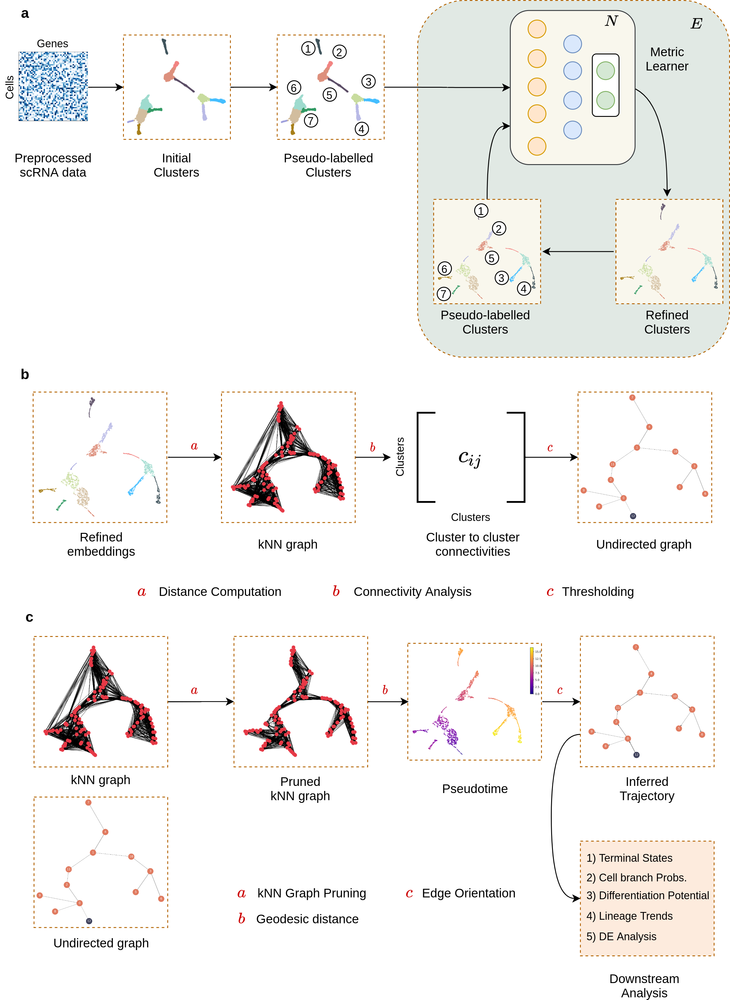
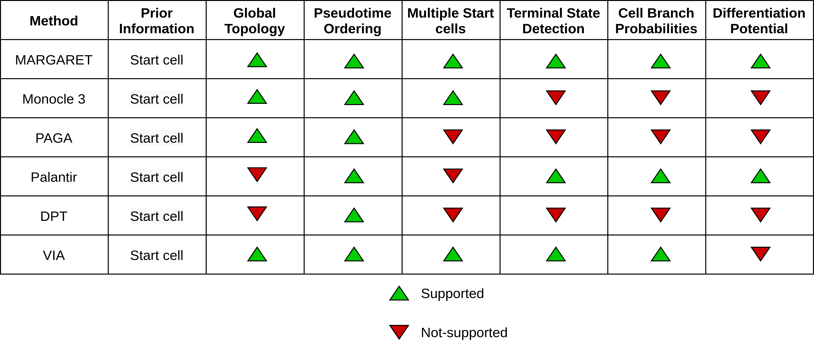

## Overview
---
`MARGARET` is a computational tool for **Trajectory Inference** i.e. for inferring trajectories underlying biological developmental processes like cell-differentiation. More specifically:

1. `MARGARET` utilizes a deep unsupervised metric learning-based approach for inferring low-dimensional cellular embeddings and cluster assignments at a single-cell (sc) level from omics-type data (e.g. transcriptomics (scRNA-seq), proteomics (CITE-seq), among many others)

2. `MARGARET` employs a novel measure of connectivity to assess connectivity between the inferred clusters in the first step and constructs a cluster-level undirected graph to represent a trajectory topology.

3. `MARGARET` then contructs a kNN graph between all cells (on a single-cell level) and **prunes** it with reference to the undirected graph computed previously. With a starting cell specified, `MARGARET` then assigns a **pseudotime** to each cell in the pruned kNN graph denoting the position of this cell in the underlying trajectory.

4. Given the pseudptime for each cell and the undirected graph inferred in Step 2, `MARGARET` directs the edges in the undirected graph which represents the final underlying trajectory.

4. Different inferred components (like the trajectory, cell embeddings and clusters) can then be utilized for downstream tasks like Terminal state detection and cell-fate prediction.

An end-to-end workflow in MARGARET can be described as:

For more details, refer to our manuscript "Inference of cell state transitions and cell fate plasticity from single-cell with MARGARET" at https://www.biorxiv.org/content/10.1101/2021.10.22.465455v1

## Installation
---

A stable `pip` installable release for MARGARET will be made available shortly. For now, we recommend users to directly clone our stable `main` branch and set `margaret` as the working directory. All package dependencies for using MARGARET can be setup as follows: 

1. Install `pipenv` by running `pip install pipenv`
2. With `margaret` as the working directory run `pipenv install` to setup all required dependencies.

Running `pipenv` for the first time will auto-create a project wide virtual environment :)

## What computational tasks can MARGARET be used for?
---

`MARGARET` can be used for:

1. Computing low-dimensional cell embeddings from the single-cell data.
2. Automatically inferring clusters from the data.
3. Inferring a cluster-level trajectory underlying the data
4. Pseudotime-inference
5. Automated terminal state detection
6. Quantifying cell-fate plasticity at a cell-level.

## Why should I use MARGARET?
---
`MARGARET` supports several features that prior works in Trajectory Inference do not support. Moreover, on a diverse benchmark MARGARET outperforms prior methods in TI. We encourage interested readers to refer to our manuscript for more details on comparisons.

## Tutorials
---

Check out the following Colab notebooks to get a flavor of a typical workflow in Trajectory Inference and `MARGARET`s capabilities:

1. [MARGARET applied to simulated datasets](https://colab.research.google.com/drive/1Tnsq8ieB04FdO8TzGUkqWjTUAwz1Ae15?usp=sharing)
2. [MARGARET applied to scRNA-seq data for early human hematopoiesis](https://colab.research.google.com/drive/1F7B1ChAaLDx_U5drC9uazPc-I5TDD1tY?usp=sharing)
3. [MARGARET applied to scRNA-seq data for early embryogenesis](https://colab.research.google.com/drive/1FPPAZiVPiBXmakzmGkBsVABrjUW6YfM-?usp=sharing)

## Authors

Kushagra Pandey, Hamim Zafar
